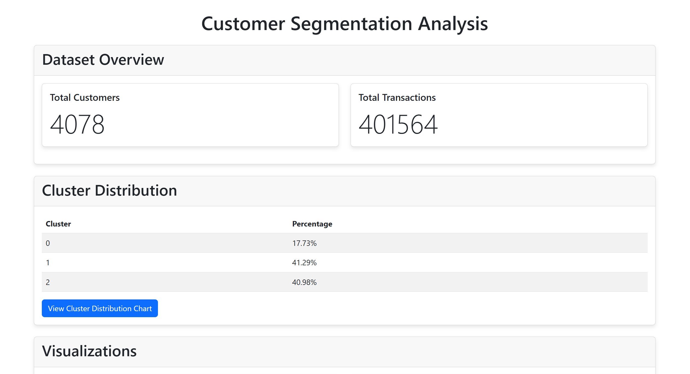

# 🛍️ Customer Segmentation Analysis Web Application 

## 📌 Overview

This project is a web application that performs customer segmentation analysis on retail transaction data. It uses machine learning techniques to cluster customers based on their purchasing behavior and provides interactive visualizations to explore the results
---

## 🚀 Features

- **Data Processing**: Cleans and preprocesses retail transaction data  
- **Feature Engineering**: Creates customer-level features like recency, frequency, and monetary values  
- **Clustering**: Uses PCA and K-means to segment customers into distinct groups  
- **Interactive Visualizations**:
  - Cluster distribution charts  
  - 3D scatter plots of customer clusters  
  - Radar charts showing cluster characteristics  
- **Customer Lookup**: Search for individual customers to view details and transaction history  

---

### Demo Video

[](https://www.youtube.com/watch?v=b9L0cvo7Nws)

## 🧰 Technologies Used

### Backend
- Python  
- Flask (web framework)  
- Pandas (data manipulation)  
- Scikit-learn (machine learning)  
- Matplotlib / Seaborn (static visualizations)  
- Plotly (interactive visualizations)  

### Frontend
- HTML / CSS / JavaScript  
- Bootstrap (responsive design)  
- Plotly.js (interactive charts)  

---

1. **Clone the repository:**

```bash
git clone https://github.com/yourusername/customer-segmentation-flask.git
cd customer-segmentation-flask
